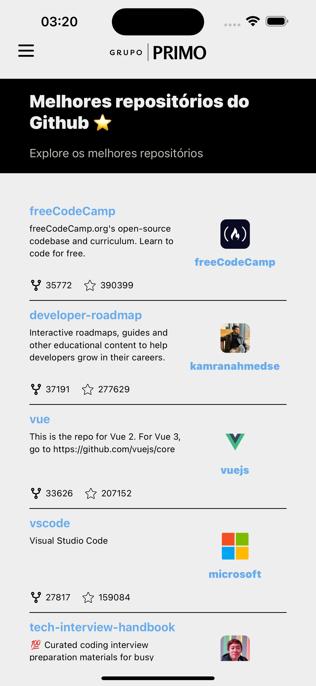
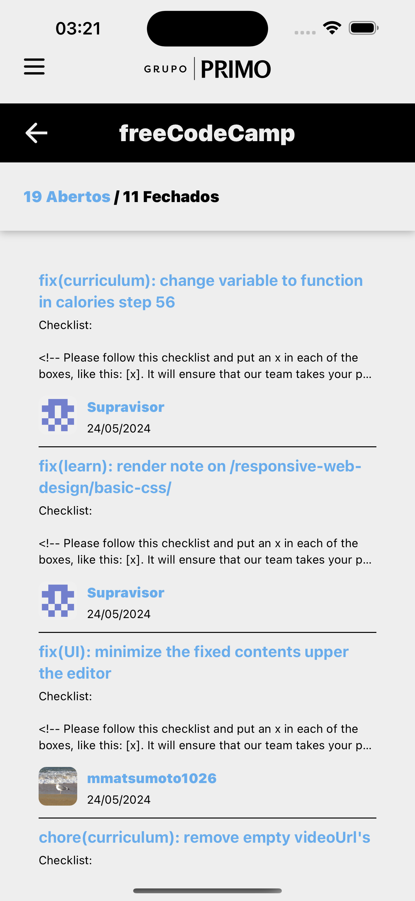
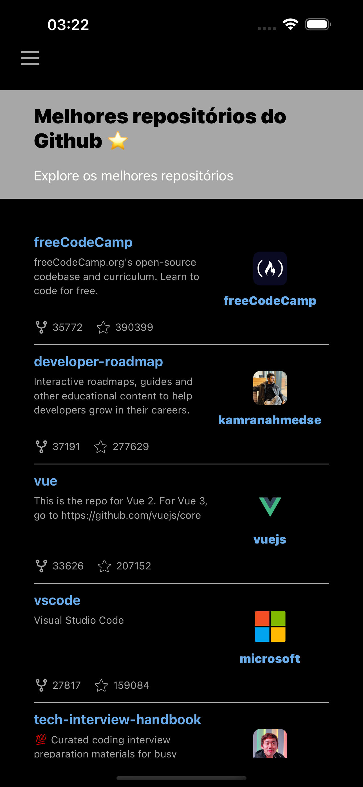
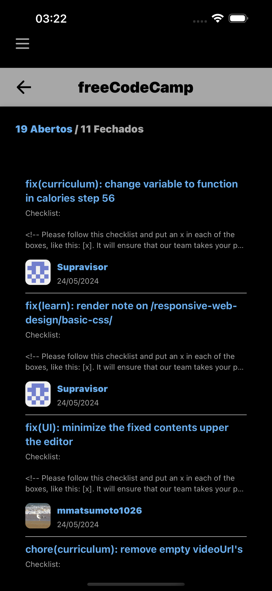

# Best Github Repos APP

Esse projeto é uma aplicação mobile que consome a API do Github para listar os repositórios mais populares da linguagem TypeScript. O usuário pode visualizar detalhes do repositório, como número de estrelas, forks e pull requests.

Abaixo você encontrará informações importantes sobre o projeto como: tecnologias utilizadas, como rodar o projeto e como rodar os testes.

## Tecnologias Utilizadas

- React Native
- TypeScript
- @shopify/restyle
- Axios
- React Navigation
- React query
- msw
- Jest

## Configuração do Arquivo .env

Para rodar o projeto é necessário criar um arquivo `.env` na raiz do projeto com a seguinte chave:

```
BASE_URL=https://api.github.com
GITHUB_TOKEN=SEU_TOKEN_DE_ACESSO_AO_GITHUB
```

Certifique-se de substituir `SEU_TOKEN_DE_ACESSO_AO_GITHUB` pelo seu token de acesso ao Github.

## Instalação

Para instalar as dependências do projeto, execute o comando:

```bash
yarn
```

Se estiver em um macOs, execute o comando:

```bash
cd ios && pod install && cd ..
```

## Rodando o Projeto

Para rodar o projeto, execute o comando:

```bash
yarn ios
```

ou

```bash
yarn android
```

## Rodando os Testes

Para rodar os testes, execute o comando:

```bash
yarn test
```

## Screenshots




### Dark Mode




## Arquitetura

Este aplicativo React Native adota uma arquitetura que segue os conceitos de Domain-Driven Design (DDD), MVVM (Model-View-ViewModel) e Clean Architecture. A arquitetura do projeto é separada em diferentes camadas de responsabilidade, garantindo uma estrutura modular, de fácil manutenção e escalável.

## Camadas do Projeto

1. **Camada de UI**

- Responsável por gerenciar a interface do usuário e a interação com o mesmo.
- Inclui componentes de UI, telas, navegação e temas.

2. **Camada de Aplicação**

- Contém a lógica de aplicação e o gerenciamento de estado.
- Inclui hooks personalizados, serviços internos e configuração da API.

3. **Camada de Domínio**

- Foco na lógica de negócio, entidades e casos de uso.
- Contém serviços de domínio, adaptadores e tipos.

## Conclusão

A arquitetura modular deste projeto facilita a manutenção e a escalabilidade do aplicativo. A separação clara de responsabilidades através das camadas de UI, Aplicação e Domínio permite que os desenvolvedores trabalhem de forma mais eficiente e organizada, promovendo um desenvolvimento mais sustentável e de alta qualidade.
